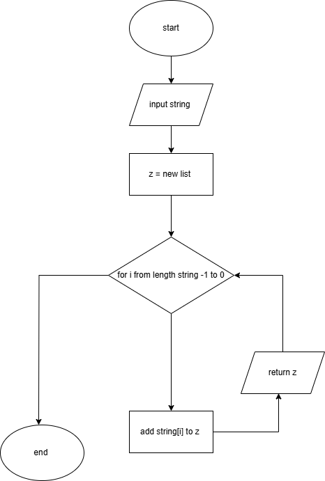
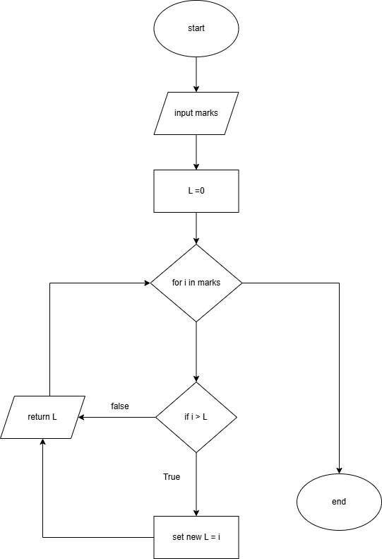
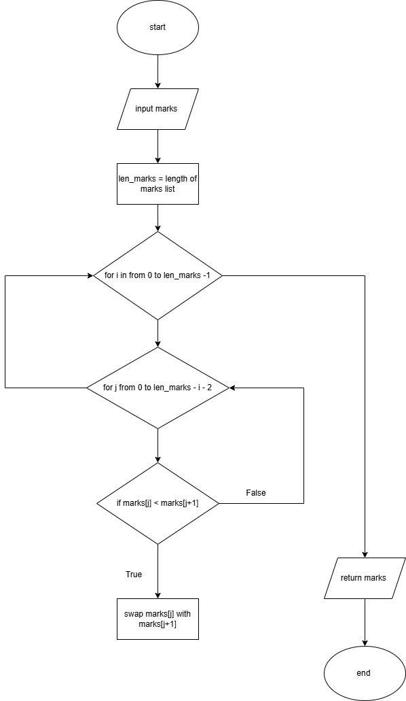
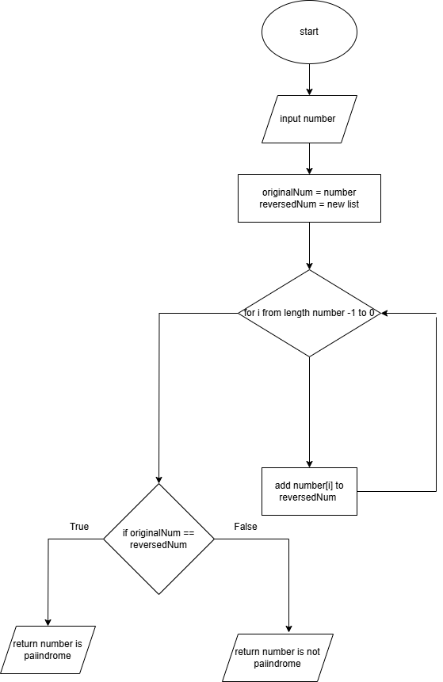

# _**Algorithm Tasks**

### Task: design an algorith for each of the following tasks in both ( pesudo code and flowchart )

#### 1. reverse a string     
###### note: i is pointer

**pesudo**

input: string = input("input your world")
z = new list
FOR i FROM LENGTH(string) - 1 TO 0
add string[i] to z list 
end for
return z

 **Flowchart**

 #### 2.search in list of student marks for the highest one
 ###### note: i is pointer
**pesudo**
input: marks 
L=0
for i in marks
if i>L
set new L = i
end for
return L

**Flowchart**

#### 3. Sort the students marks from highest to lowest    
###### note: first loop forn selest the number of loop, second loop foe com
**Pesudo""
input : list of marks
len_marks is length of marks list
for i from 0 to len_marks -1
fOR j FROM 0 TO len_marks-i-2
if IF marks[j] < marks[j+1] THEN
SWAP marks[j] WITH marks[j+1]
end for 
end for 
return marks

**Flowchart**

#### 4.check if number is palindrome ( ex: 3443 is palindrome , 56 is not palindrome , 454 is palindrome )
**Pesudo""

input number
originalNum = number
reversedNum = new list
FOR i FROM LENGTH(number) - 1 TO 0
add number[i] to reversedNum list 
end for
if originalNum ==reversedNum
return palindrome
else return  not palindrome

**Flowchart**

