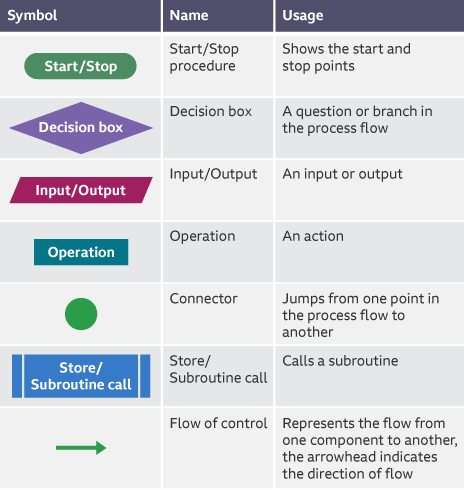

# *Algorithm and Programming Paradigm Summary*

## programming Paradigm

It is the way to sole any problem using Pragramming language

##### Types of programming paradigm

##### 1. Imperative programming paradigm:
In this way the progamming language can write the sequance or orders forms. Thus, The main focus is on how to achieve the goal.

##### 2.Declarative programming paradigm: 
In this way the programming language can write code to translate constant facts role.

##### Types of Imperative programming paradigm
    1. Procedural programming : constant steps
    2. Object oriented programming :based on ojects and their attribute and methods 
    3. Parallel processing : is the way to excute the procedues at same time

##### Types of Declarative programming paradigm
    1. Logic programming : excuted with program based on conclusions based on facts and laws
    2. Functional programming: excuted with program that based on the results of rapid operations and display the results quickly.
    3. Database/Data driven programming : excuted with program based on get specific in data from database.

## Algorithm
* An algorithm is a step-by-step procedure to solve a problem or perform a task.
##### Characteristics of a Good Algorithm 
1. Correctness – It should solve the problem correctly. 
2. Efficiency – It should run in a reasonable amount of time. 
3. Clarity – Easy to understand and implement. 
4. Finiteness – It must have an end. 
5. Generality – It should work for multiple inputs.

##### Forms of Algorithm:
1. pseudocode
2. Flow Chart 
3. implemented in a programming language

* Flowchart Component:

##### Types of Algorithms:
1. Sequential Algorithm (Step-by-step Execution) 
2. Iterative Algorithm (Using Loops)
3. Recursive Algorithm (Function Calls Itself)

##### Algorithm  Components
1. Variables : used to store values
2. Input and Output statements : used to get and display data  
3. Conditional Statements (Decision Making): used to make Decision
4. Loops (Iteration) : used to repetition
5. Functions (Procedures) : used to code reuse
6. Arrays and Lists : used to store many values in same variable 

