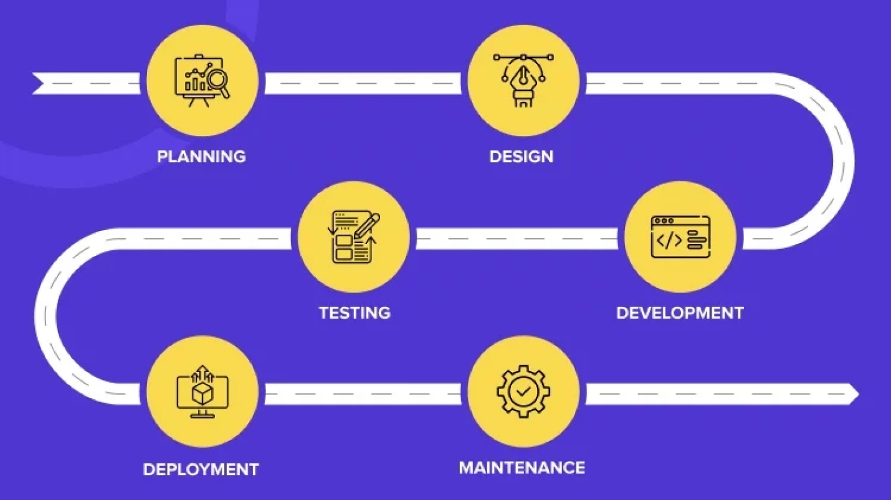
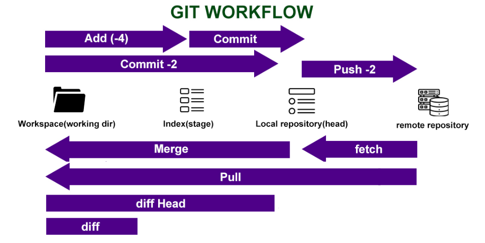
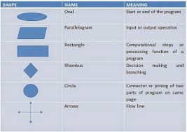
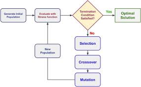

# Chapter One Documentation Report 
## Software Development Life Cycle ( SDLC ) 

#### The SDLC phases:
 
1. Analysis
2. Design
3. Development
4. Testing
5. Deployment
6. Maintenance

#### The roles / titles that you know in the SDLC:
1. Product Owner
2. Project Manager
3. Business Analyst
4. CTO
5. UX/UI designer 
6. System Architect
7. Front end developer
8. Backend developer
9. Solutions Architect
10. DevOps
11. Data administrator 
12. Tester
13. Support managers

## Agile Methodology and Scrum framework
#### The agile methodology
The Agile methodology is a type of project management approach that involves breaking the tasks of project into groups, commonly known as sprints. Teams follow a SDLC in every sprint in different time.

- The purposes of agile are:
1. Work flexible
2. Time-Efficient
3. Speed performance through complete the main features of project then deployment the project.
4. Frequent Changes
5.Customer Satisfaction by done work in less time.

#### The different between Agile and Waterfall
-- Waterfall model 
* Advantage: provide whole view of project at the begining. 
* Disadvantage : delay in completing project.
* Use: 
    1. If the time factor is not important.
    2.Limited Resources, Small to Medium-Sized Projects.
    3.Little Changes Expected and Well-understood Requirements
* Best practic : Human Resource Management Systems (HRMS) 

-- Agile model
* Advantage: Work flexible, Time-Efficient
* Disadvantage : prioritizes working on projects rather than paperwork. thus will be have less documnetaion 
* Use: 
    1. Unclear or Changing Requirements.
    2. Complex Projects.
    3. Quick Time-to-Market 
* Best practic : bank system

#### The frameworks which are used for implementing agile
1. Scrum Framework
2. Kanban
3. EasyReto

#### The scrum framework 

Scrum Framework is the most popular frameworks used to practice Agile, that organizes projects in iterations called Sprints.

Steps:
1. product owner meet with project stakeholders to discusse the project requirments (stories), the result of this meeting is product backlog. every requirments in product backlog called stoty, and also provide explaination of this story this explaination called user story.

this product backlog involoves :
•	story: every task 
•	user story: explaination of task as how user will done  in this task.
•	acceptance criteria: explain how should task be in side of features user movements and so on. 
•	priority: priporitize each task.
•	estimation: estimate the difficulty of each task.
•	Description: additional project description

2. product owner meet with project team to select sprint backlog this meet called sprint planning team, the purpose of this meet is to break the stories in different group which every group called sprint,  which the developers team will focus to develop this first of sprint backlog. thus, this type of meet do evey time work with new sprint backlog, may after every 3 months or more the time selected as agreed between product owner and developers team.

3. During develop sprint backlog, the team meet with each other everyday to follow up the sprint backlog this meet called daily scrum meeting. In this type of meeting the scurm master presides over the meeting.

4. After complete develope first sprint backlog, product ower meet with stakeholders agine to inform them of complete first sprint backlog , or delivery project. this meet called sprint review.

5. Before work with new sprint backlog the team and product owner meet togather to identify strengths and weaknesses of previous sprint backlog, this meeting called sprint retrospective.

6. Agein meet (sprint planning meeting) between product owner and developers meet to ideftify new sprint backlog.
7. Then do some process with new sprint backlog.

## Git Version Control

#### Some cloud repositories that uses git version control
-Github
-GitLab 
-Bitbucket
-GCP (Google Cloud Platform)
#### State Some Commands
* git config --global user.name “Your Name”
It is used to set the name that will be attached to your commits and tags.
* git config --global user.email “you@example.com”
It is used set the e-mail address that will be attached to your commits and tags.
* git init
It is used to create an empty Git repository. 
* git add "file name"
It is used to add specific to the staging area.
* git add .
It is used to add all files in the working directory to the staging area.
* git commit
It is used to makes sure that the changes are saved to the local repository.
* git status
It is used to know the current state of the repository.
* git clone <url>
It is used to create a local working copy of an existing remote repository.
* git pull
It is used to fetch and merge changes from the remote repository to the local repository.
* git push
It is used to transfer the commits or pushing the content from the local repository to the remote repository.
* git diff 
It is used to show changes between working directory and staging area.
* git log
It is used to show the order of the commit history for a repository.
* git remote 
It is used to manage set of tracked repositories
* git remote add [alias] [url]
It is used to add a git URL as an alias
* git diff --staged [file]
It is used to shows any changes between the staging area and the repository.
* git log --oneline 
It is used to view the commit history in your Git repository.

## Algorithm design ( Pseudo code and flowchart ) 

## Web Development Stacks

## Programming Paradigms 

It is the way to sole any problem using Pragramming language

##### Types of programming paradigm

##### 1. Imperative programming paradigm:
In this way the progamming language can write the sequance or orders forms. Thus, The main focus is on how to achieve the goal.

##### 2.Declarative programming paradigm: 
In this way the programming language can write code to translate constant facts role.

##### Types of Imperative programming paradigm
    1. Procedural programming : constant steps
    2. Object oriented programming :based on ojects and their attribute and methods 
    3. Parallel processing : is the way to excute the procedues at same time

##### Types of Declarative programming paradigm
    1. Logic programming : excuted with program based on conclusions based on facts and laws
    2. Functional programming: excuted with program that based on the results of rapid operations and display the results quickly.
    3. Database/Data driven programming : excuted with program based on get specific in data from database.

## Algorithm programming components

##### Algorithm  Components
1. Variables : used to store values
2. Input and Output statements : used to get and display data  
3. Conditional Statements (Decision Making): used to make Decision
4. Loops (Iteration) : used to repetition
5. Functions (Procedures) : used to code reuse
6. Arrays and Lists : used to store many values in same variable 
##### Examples 
1. Flowchart 

## Types of programming languages ( based on machine interaction, execution )

## Comparison of compiler and interpreter

## Data types, Variables, Constants and input/ output statements 
- Data Type :
in the programming language world, there are different data type deal with such as integer, float, string boolean, array, list elt. 

- variable : A variable is a container that holds a value, each variable has a data type that defines what kind of data it can store. 
- constant : is constant has value which can not change tafter assignment. 
-Input / output statemets: any program has inputs from user and process those to be get the results which will show it, thus, this results called output. 

##  Arithmetic and logic operators 

##  Conditional statements ( if else / switch case ) 

##  Looping ( for, while and do while ) 

## Nested operations ( nested conditions and nested looping )

##  Array data structure 

S